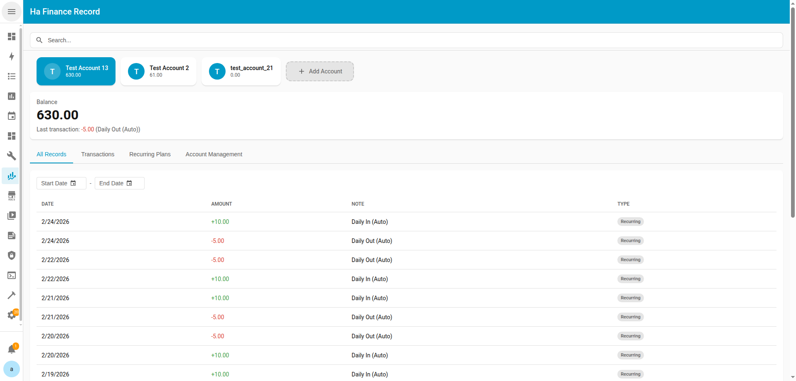
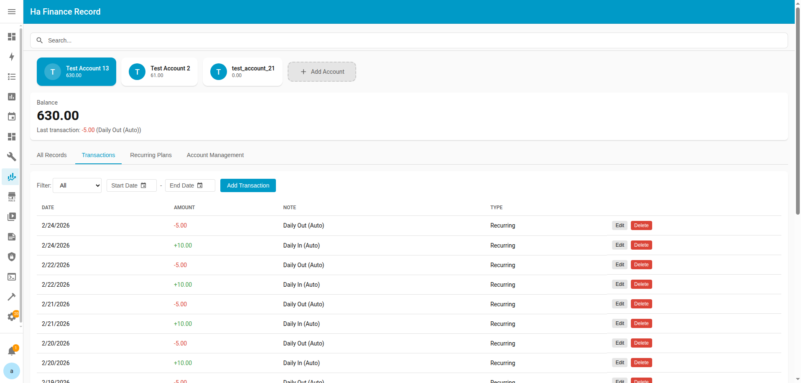
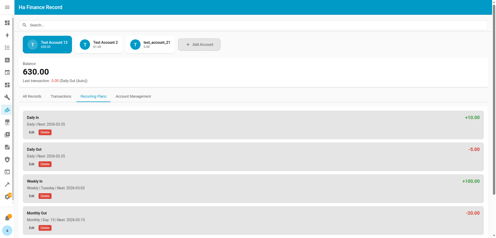
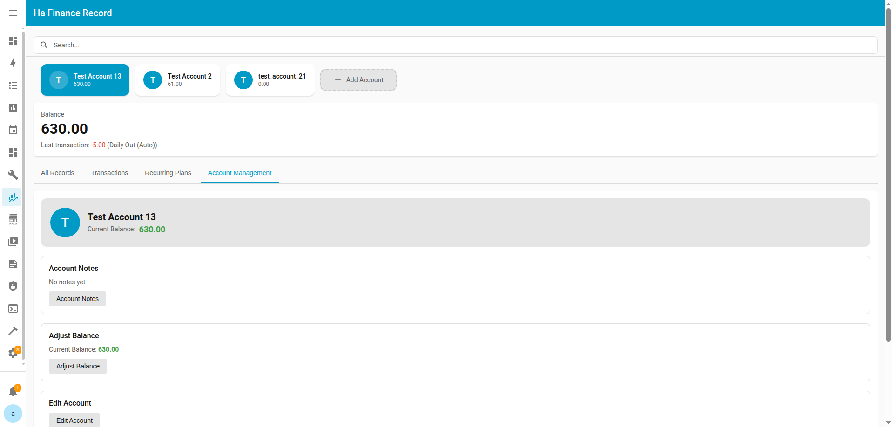
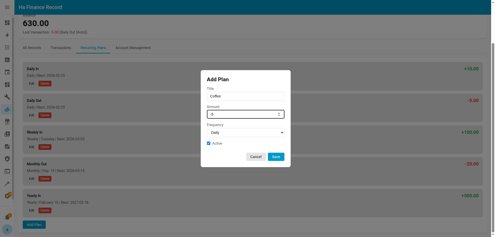
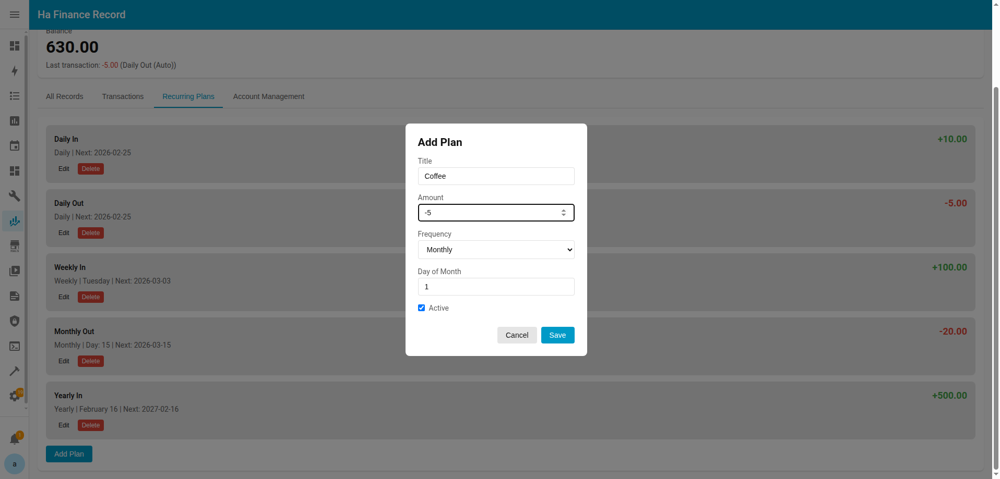
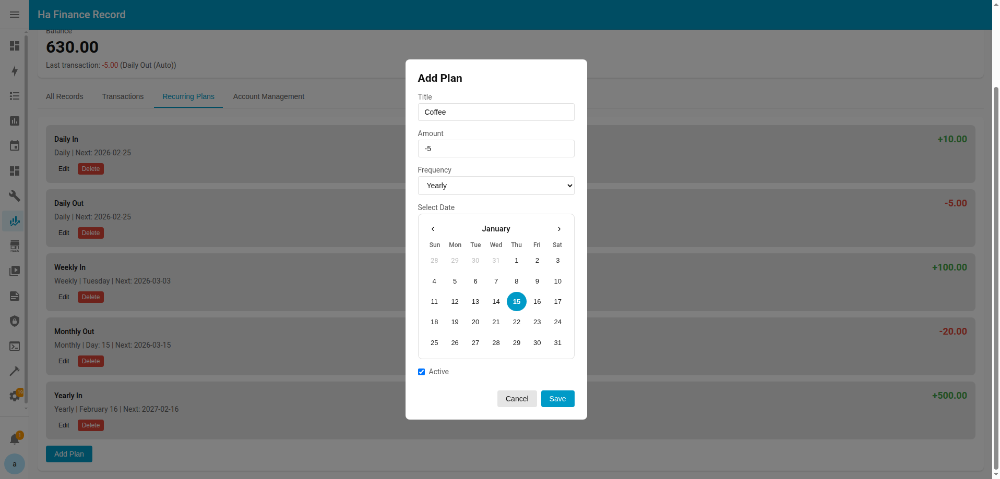

# Ha Finance Record

A Home Assistant custom component for personal finance tracking. Manage multiple accounts, record transactions, set up recurring plans, and visualize your finances — all from the HA sidebar.

[繁體中文版 README](README_TW.md)

## Features

- **Multi-Account Management** — Create and manage multiple financial accounts, each with its own balance, transactions, and recurring plans.
- **Quick Transaction Recording** — Enter amount + note and press "Confirm Record" to log income or expenses instantly.
- **Recurring Plans** — Schedule automatic transactions (income or expense) on a daily, weekly, monthly, or yearly basis.
- **Sidebar Panel** — A Lit Element–based dashboard in the HA sidebar with transaction history, charts, and account management tabs.

## Installation

### HACS (Manual Repository)

1. Open HACS in Home Assistant.
2. Go to **Integrations** → three-dot menu → **Custom repositories**.
3. Add `https://github.com/woowtech-ai-coder/ha_finance` as an **Integration**.
4. Search for "Finance Record" and install.
5. Restart Home Assistant.

### Manual

1. Copy the `custom_components/ha_finance/` folder into your Home Assistant `config/custom_components/` directory.
2. Restart Home Assistant.

## Configuration

1. Go to **Settings** → **Devices & Services** → **Add Integration**.
2. Search for **Finance Record**.
3. Enter an account name, optional account ID, and initial balance.
4. To add more accounts, repeat the process — each config entry creates a separate account.

### Options

After setup, click **Configure** on the integration entry to:

- Add or manage recurring plans (income/expense schedules)
- Edit account settings
- Delete the account

## Sidebar Panel

After adding at least one account, a **Finance Record** panel appears in the HA sidebar. It provides:

- Transaction history with date filtering and quick transaction entry

- Recurring Plans

- Account overview and management

### Adding a Recurring Plan

Navigate to the **Recurring Plans** tab and click **Add Plan**. Choose a frequency to schedule automatic transactions:

**Daily** — Executes every day. Just set a title and amount.

**Weekly** — Executes on a specific day of the week (Monday–Sunday).

**Monthly** — Executes on a specific day of the month (1–28).

**Yearly** — Executes on a specific date each year, selected via calendar.

