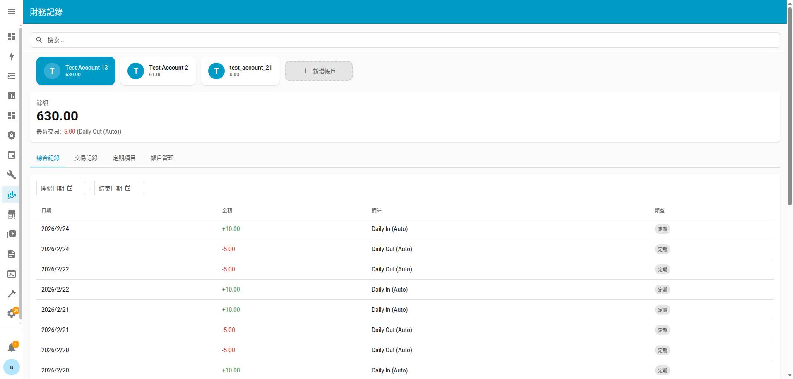
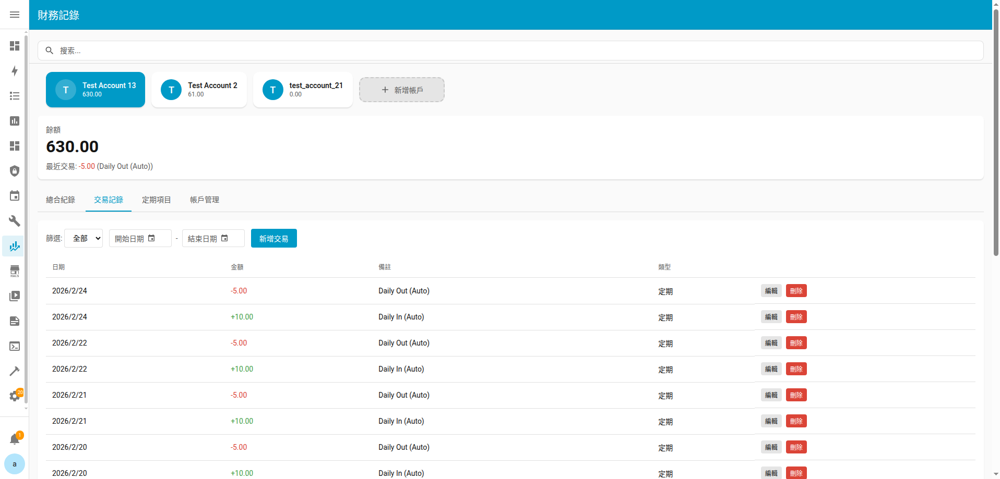
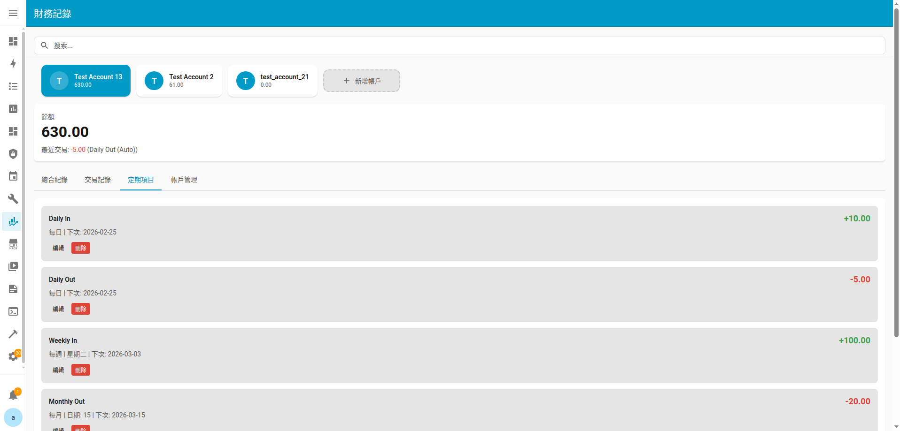
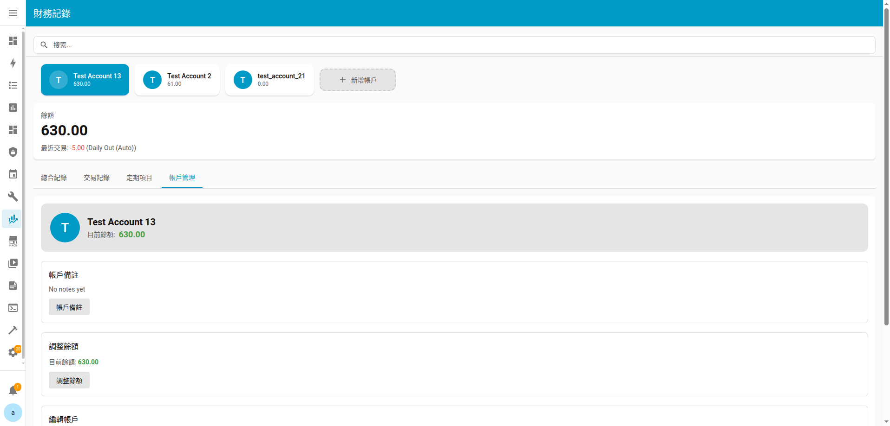
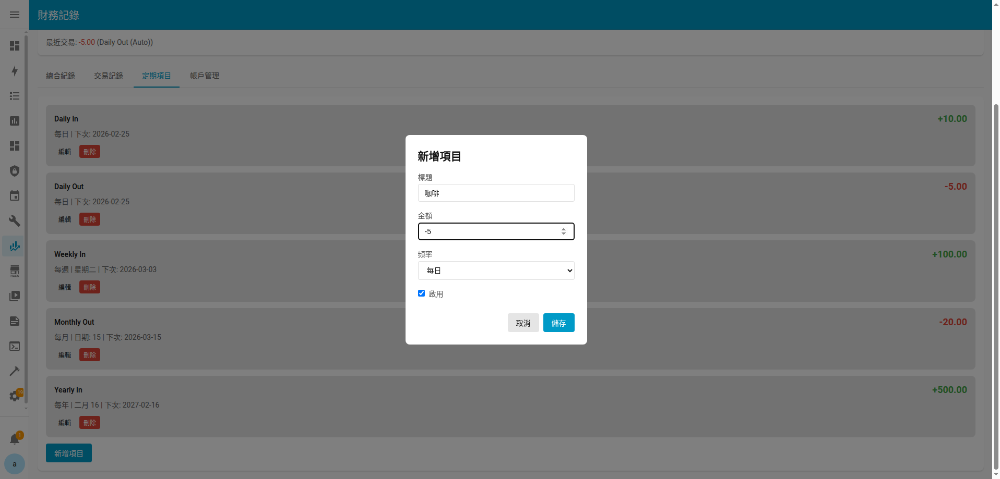
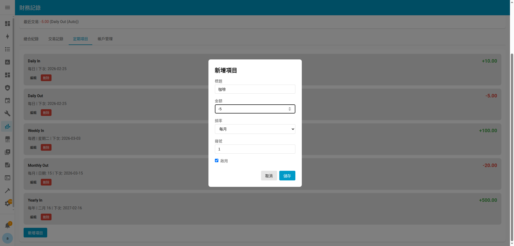
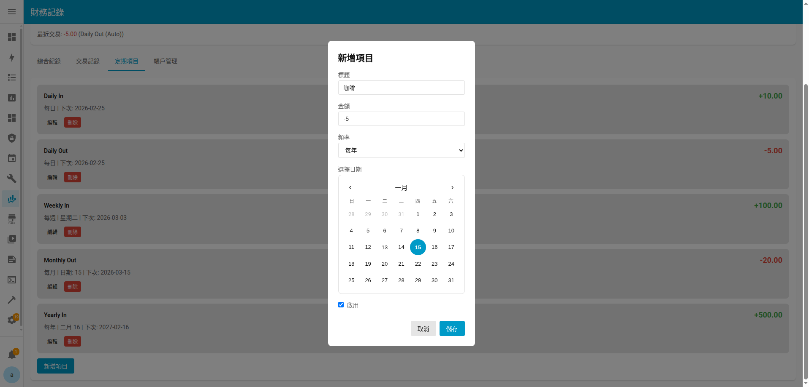

# Ha Finance Record（財務紀錄）

Home Assistant 自訂整合元件，用於個人財務追蹤。管理多個帳戶、記錄交易、設定定期計畫，並透過 HA 側邊欄查看財務概覽。

[English README](README.md)

## 功能特色

- **多帳戶管理** — 建立並管理多個財務帳戶，各自擁有獨立的餘額、交易紀錄與定期計畫。
- **快速記帳** — 輸入金額與備註，按下「確認記錄」即可立即登記收入或支出。
- **定期計畫** — 設定每日、每週、每月或每年自動執行的收入/支出計畫。
- **側邊欄面板** — 基於 Lit Element 的儀表板，位於 HA 側邊欄中，提供交易紀錄、圖表與帳戶管理功能。

## 安裝方式

### HACS（手動新增儲存庫）

1. 在 Home Assistant 中開啟 HACS。
2. 前往 **整合** → 右上角三點選單 → **自訂儲存庫**。
3. 新增 `https://github.com/woowtech-ai-coder/ha_finance`，類型選擇 **Integration**。
4. 搜尋「Finance Record」並安裝。
5. 重新啟動 Home Assistant。

### 手動安裝

1. 將 `custom_components/ha_finance/` 資料夾複製到 Home Assistant 的 `config/custom_components/` 目錄下。
2. 重新啟動 Home Assistant。

## 設定

1. 前往 **設定** → **裝置與服務** → **新增整合**。
2. 搜尋 **Finance Record**。
3. 輸入帳戶名稱、選填帳戶 ID，以及初始餘額。
4. 若需新增更多帳戶，重複上述步驟 — 每個設定項目會建立獨立帳戶。

### 選項設定

設定完成後，點選整合項目上的 **設定** 可以：

- 新增或管理定期計畫（收入/支出排程）
- 編輯帳戶設定
- 刪除帳戶

## 側邊欄面板

新增至少一個帳戶後，HA 側邊欄會出現 **財務紀錄** 面板，提供：

- 交易紀錄與日期篩選和快速記帳功能

- 定期交易

- 帳戶總覽與管理

### 新增定期計畫

前往 **定期項目** 分頁，點擊 **新增項目**。選擇頻率以排程自動交易：

**每日** — 每天執行。僅需設定名稱與金額。

**每週** — 於每週指定的星期幾執行（星期一至星期日）。

**每月** — 於每月指定日期執行（1–28 日）。

**每年** — 於每年指定日期執行，透過日曆選擇。

